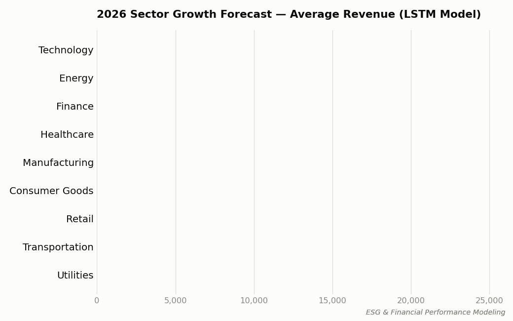
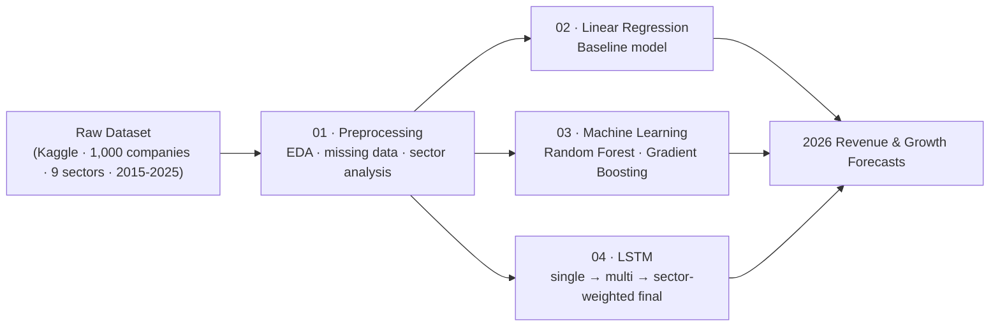
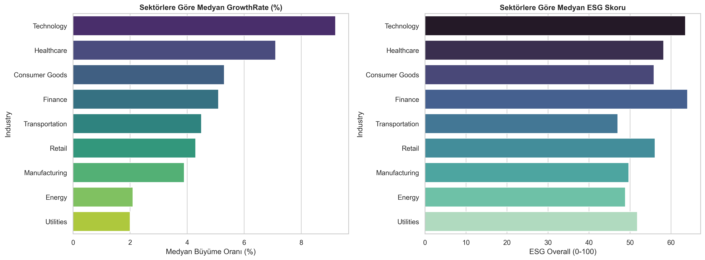
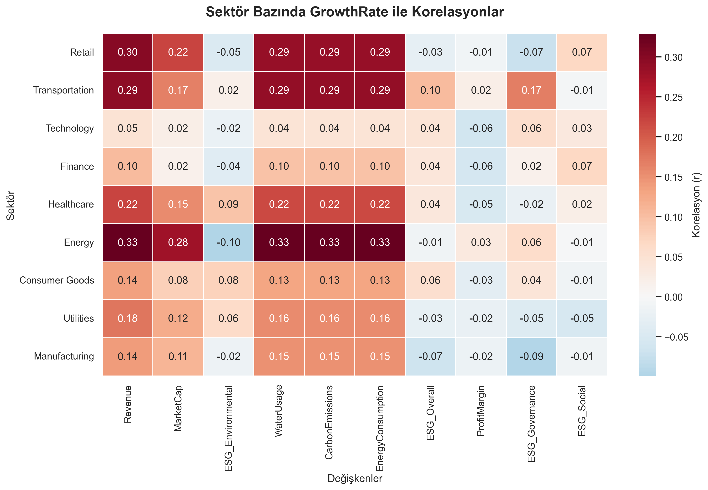

<div align="center">

# 🌱 ESG and Financial Performance Modeling with Deep Learning

**Predicting corporate revenue and growth from financial + ESG data — Linear Regression → Machine Learning → LSTM**


</div>

A machine learning / deep learning study that predicts companies' future revenue and growth performance by combining traditional financial indicators with ESG (Environmental, Social, Governance) scores, and evaluates how much sustainability metrics actually explain corporate growth. This repository contains the full analysis pipeline: data exploration, a linear regression baseline, classical machine learning models, and a final LSTM-based time-series model used to forecast 2026 revenue.

<div align="center">

</div>

## Contents

- [Overview](#overview)
- [Pipeline](#pipeline)
- [Repository Structure](#repository-structure)
- [Dataset](#dataset)
- [Methodology](#methodology)
- [Selected Figures](#selected-figures)
- [Key Findings](#key-findings)
- [Tech Stack](#tech-stack)
- [References](#references)

## Overview

The study integrates 11 years (2015–2025) of financial and ESG data for 1,000 companies across 9 sectors, and tests three modeling families of increasing complexity:

1. **Linear Regression** — a classical, interpretable baseline.
2. **Classical Machine Learning** (Random Forest, Gradient Boosting) — to capture non-linear relationships and rank feature importance.
3. **LSTM (Long Short-Term Memory) neural network** — the study's primary model, chosen for its ability to directly learn temporal dependencies in each company's multi-year financial trajectory.

Across all three approaches, the analysis finds that **ESG scores do not have a strong direct, average effect on revenue growth**, but their effect is **sector-dependent**: positive in Energy, Healthcare and Technology, and associated with compliance-cost drag in sectors like Retail and Utilities. Sector identity and a company's own financial history remain the strongest predictors of future growth.

## Pipeline



Each `src/` stage can be run independently and corresponds to one phase of the analysis (data understanding → baseline model → machine learning models → deep learning model).

## Repository Structure

<details>
<summary><b>Click to expand full folder tree</b></summary>

```
.
├── data/
│   ├── raw/                       # Full dataset (not included — see Dataset section)
│   └── by_sector/                 # Dataset split into 9 per-sector CSVs (not included)
├── src/
│   ├── 01_preprocessing/          # Data overview, sector/region analysis, missing-value handling
│   ├── 02_linear_regression/      # Baseline OLS regression model
│   ├── 03_machine_learning/       # Feature engineering + Random Forest / Gradient Boosting models
│   └── 04_lstm/
│       ├── 01_single_lstm/            # First single-company LSTM prototype
│       ├── 02_multi_lstm/             # Multi-company LSTM: data prep, training, prediction, visualization
│       └── 03_sector_weighted_lstm_final/   # Final sector-aware LSTM model (headline results)
├── results/
│   ├── figures/                   # All generated charts (EDA, model diagnostics, 2026 forecasts)
│   └── tables/                    # All generated metrics/prediction tables (CSV)
└── archive/                       # Early exploratory notebook, kept for reference
```

</details>

## Dataset

This project uses the **[ESG and Financial Performance Dataset](https://www.kaggle.com/datasets/shriyashjagtap/esg-and-financial-performance-dataset)** by Shriyash Jagtap (Kaggle).

| | |
|---|---|
| **Companies** | 1,000 |
| **Sectors** | 9 — Technology, Energy, Transportation, Healthcare, Finance, Consumer Goods, Utilities, Retail, Manufacturing |
| **Time range** | 2015–2025 (~11,000 company-year records, 16 columns) |
| **Financial variables** | `Revenue`, `ProfitMargin`, `MarketCap`, `GrowthRate` |
| **ESG variables** | `ESG_Overall`, `ESG_Environmental`, `ESG_Social`, `ESG_Governance` |
| **Environmental variables** | `CarbonEmissions`, `WaterUsage`, `EnergyConsumption` |

The raw dataset is **not included in this repository**. To reproduce the analysis:

1. Download `company_esg_financial_dataset.csv` from the Kaggle link above.
2. Place it at `data/raw/company_esg_financial_dataset.csv`.
3. Run the sector-split script in `src/01_preprocessing/` to (re)generate the per-sector files in `data/by_sector/`.

All scripts and notebooks reference the dataset through relative paths matching this folder structure (e.g. `../../data/raw/company_esg_financial_dataset.csv`), so no path edits should be needed once the file is in place.

## Methodology

### 1 · Data Preprocessing (`src/01_preprocessing/`)
Missing-value analysis, sector/region-level descriptive statistics, and correlation analysis. The only imputation applied was filling missing `GrowthRate` values with each company's own median (chosen after finding no strong external correlation to impute from), preserving cross-company heterogeneity.

### 2 · Linear Regression Baseline (`src/02_linear_regression/`)
An OLS model using core financial and structural variables (ESG and environmental variables intentionally excluded to isolate the baseline). Evaluated on an 80/20 train/test split plus 5-fold cross-validation.

| Metric | Test Set | 5-fold CV (mean ± std) |
|---|---|---|
| R² | 0.8189 | 0.7122 ± 0.0628 |
| RMSE | 5013.41 | — |
| MAE | 2105.05 | — |
| MAPE | 105.88% | — |

The high MAPE and CV variance indicate the linear model struggles with heteroscedasticity and company-size effects — motivating the more flexible models below.

### 3 · Machine Learning Models (`src/03_machine_learning/`)
Three lag/rolling-feature-based regressors (`Revenue_Lag1`, `Revenue_Rolling3`, `ProfitMargin_Lag1`) were trained on 2015–2024 and evaluated on a 2025 holdout year:

| Model | MAE | R² |
|---|---|---|
| **Linear Regression** | **315.40** | **0.9972** |
| Gradient Boosting | 414.52 | 0.9882 |
| Random Forest | 415.58 | 0.9860 |

*(Note: this single-year, lag-feature holdout setup is not directly comparable to the multi-year LSTM evaluation below — see Key Findings.)*

A K-Means clustering (4 clusters, on `Revenue`, `ProfitMargin`, `ESG_Overall`) and a Random Forest feature-importance analysis were also performed; `ProfitMargin`, `ESG_Governance` and `ESG_Social` emerged as the strongest predictors of cluster membership.

### 4 · LSTM Model (`src/04_lstm/`) — Final Model
A 2-layer LSTM network trained on rolling 3-year input windows across all companies, predicting the following year's (log-transformed) revenue:

```
LSTM(64 units, return_sequences=True, L2 regularization)
Dropout(0.2)
LSTM(32 units, L2 regularization)
Dropout(0.2)
Dense(16, ReLU)
Dense(1)
```

- **Scaling:** RobustScaler (outlier-resistant)
- **Target transform:** `log1p(Revenue)`
- **Sector information:** one-hot encoded `Industry` fed into every timestep, so the model learns sector-specific growth dynamics directly
- **Optimizer:** Adam, with early stopping to prevent overfitting

Evaluated on a 2023–2025 holdout:

| Metric | Value |
|---|---|
| R² | 0.9691 |
| RMSE | 2386.64 |
| MAE | 534.89 |
| MAPE | 7.26% |

The LSTM model was identified as the study's primary/best-performing model overall, since it directly models temporal dependency across the full 11-year window and consistently produced realistic, outlier-free 2026 forecasts — unlike the baseline models.

## Selected Figures

<table>
<tr>
<td width="50%">

<p align="center"><sub>K-Means clustering — Revenue vs ESG score</sub></p>
</td>
<td width="50%">

<p align="center"><sub>Growth-rate correlations by sector</sub></p>
</td>
</tr>
</table>

More figures are available in [`results/figures/`](results/figures/), including EDA distributions, model error curves, and per-sector trend charts.

## Key Findings

- 🏭 **Sector matters more than ESG for growth.** Across all model families, sector identity and a company's own financial trajectory were consistently the strongest predictors of future growth — not ESG scores in isolation.
- 🌱 **ESG's effect is sector-conditional.** ESG improvements correlate with positive growth expectations in Energy, Healthcare and Technology, while in sectors like Retail and Utilities, ESG compliance appears associated with growth headwinds rather than tailwinds.
- 📈 **2026 sector outlook (LSTM forecast):** Technology and Energy show the highest projected growth; Transportation is projected to remain comparatively stagnant.
- 🧠 **Model comparison:** LSTM clearly outperformed the linear regression baseline (R² 0.97 vs 0.82) and, in the study's overall assessment, outperformed classical ML in capturing dynamic, time-dependent structure — supporting the case that deep learning adds real value over traditional approaches when time-series structure is present.

## Tech Stack

- **Data / ML:** pandas, numpy, scipy, scikit-learn, xgboost, statsmodels, shap
- **Deep Learning:** TensorFlow / Keras
- **Visualization:** matplotlib, seaborn

## References

1. Hochreiter, S., & Schmidhuber, J. (1997). Long short-term memory. *Neural Computation*, 9(8), 1735–1780.
2. Fischer, T., & Krauss, C. (2018). Deep learning with long short-term memory networks for financial market predictions. *European Journal of Operational Research*, 270(2), 654–669.
3. Friede, G., Busch, T., & Bassen, A. (2015). ESG and financial performance: Aggregated evidence from more than 2000 empirical studies. *Journal of Sustainable Finance & Investment*, 5(4), 210–233.
4. NYU Stern Center for Sustainable Business (2021). ESG and financial performance: Uncovering the relationship by aggregating evidence from 1,000+ studies published between 2015–2020.
5. Jagtap, S. ESG and Financial Performance Dataset. Kaggle. https://www.kaggle.com/datasets/shriyashjagtap/esg-and-financial-performance-dataset

---

<div align="center">
<sub>Author: Adar Öztuncer</sub>
</div>
